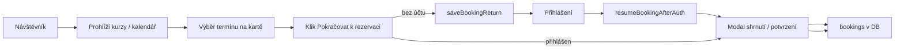

# Rezervace, přihlášení a zpětná vazba z testování

**Účel:** Sjednocení očekávání mezi zadavatelkou, testery a vývojem — co aplikace Ateliér dnes skutečně umí.  
**Stav kódu:** produkční větev v tomto repozitáři (bez ghost Edge Function).  
**Poslední srovnání s kódem:** květen 2026.

---

## 1. Shrnutí pro zadavatelku

**Ano — i magic link znamená uživatelský účet.** Po kliknutí na přihlašovací odkaz je člověk v systému jako přihlášený uživatel (`authenticated`), ne jako anonymní návštěvník. Vznikne nebo se použije záznam v Supabase Auth (`auth.users`) a profil v `public.users`.

| Co chce uživatel udělat | Bez účtu (návštěvník) | Po přihlášení |
|-------------------------|------------------------|---------------|
| Prohlížet kurzy a kalendář | Ano | Ano |
| Otevřít rozbalený kurz / detail kurzu | Ano | Ano |
| Vybrat termín a platbu na kartě (příprava) | Částečně — termíny vidí, platbu ne | Ano |
| Dokončit rezervaci (INSERT do `bookings`) | **Ne** | Ano |

**Rezervace místa vždy vyžaduje identitu** — e-mail přes magic link, heslo, registraci nebo OAuth (Google/Apple). Důvod: platby, storna, permanentky, e-maily a GDPR (vazba rezervace na konkrétní osobu).

---

## 2. Text ke sdílení se zadavatelkou (copy-paste)

> Aplikace umožňuje **prohlížet nabídku bez účtu**. Samotná **rezervace místa** ale vyžaduje identitu — e-mail přes magic link, heslo nebo registraci. Magic link není „bez účtu“: vytvoří nebo přihlásí uživatele v systému (kvůli platbám, stornům, permanentkám a GDPR).
>
> Po přihlášení umí aplikace **navázat na rozpracovanou rezervaci** (termín a platba, které návštěvník vybral před přihlášením) a otevřít potvrzovací modal — stále ale až **po** ověření identity, ne bez účtu.
>
> Plánovaná rezervace „jen na e-mail bez přihlášení“ (ghost účet přes server) **v této verzi aplikace není nasazená** — je jen v návrhu v SQL komentářích. Pokud to zadavatelka chce opravdu dodat, byla by to **samostatná feature** (Edge Function + úprava frontendu), ne drobná úprava textu.

---

## 3. Jak to funguje v aplikaci (technicky stručně)

### 3.1 Prohlížení bez přihlášení

Role `anon` v databázi smí číst aktivní kurzy a view `lesson_availability`. Návštěvník tedy vidí nabídku v **Kurzech** a **Kalendáři**.

### 3.2 Rezervace až po přihlášení

Před otevřením rezervačního modalu frontend kontroluje `currentUser`. Pokud chybí, zobrazí přihlašovací popup (`openAuthPopup`) a uloží kontext do `sessionStorage` pod klíčem `atelier_booking_return` (`saveBookingReturn` v `atelier_auth.js`).

Stejně fungují `reserveFromCard`, `openBookingPopup` a nákup permanentky z kurzu — bez session žádný INSERT do `bookings`.

Databáze to vynucuje: do tabulky `bookings` smí zapisovat jen role `authenticated`, ne `anon` (viz `atelier_rls.sql`).

### 3.3 Magic link

Při odeslání odkazu na e-mail aplikace volá Supabase `signInWithOtp` s `shouldCreateUser: true`:

- **Nový e-mail** → vytvoří se účet v Auth a po prvním přihlášení se doplní profil.
- **Existující e-mail** → uživatel se přihlásí k existujícímu účtu.

To je v praxi **„bez hesla“**, ne **„bez účtu“**.

### 3.4 Obnovení rezervace po přihlášení

Po úspěšném přihlášení (magic link, heslo, registrace, OAuth) volá aplikace `resumeBookingAfterAuth()`:

1. Načte uložený kontext z `atelier_booking_return` (kurz, termín, typ platby, permanentka…).
2. Vrátí uživatele na **Kurzy** nebo **detail kurzu**, podle toho, odkud rezervaci začal.
3. Pokud byl v kontextu požadavek otevřít booking, znovu načte data a otevře **rezervační modal** — ideálně v režimu **shrnutí** (termín + platba už vybrané), ne od nuly.

Starší klíč `pending_booking` se stále podporuje jen jako legacy fallback při čtení; nově se zapisuje `atelier_booking_return`.

### 3.5 Rezervační modal (aktuální UX)

Po výběru na kartě kurzu / v detailu:

- Modal často začíná v režimu **shrnutí** (termín, platba, cena) a jedním potvrzovacím tlačítkem.
- Odkaz **„Změnit termín nebo platbu“** rozbalí plný formulář (u workshopového balíčku se změna nenabízí).
- **Koupit permanentku a rezervovat:** po potvrzení v shrnutí aplikace zakoupí permanentku a hned rezervuje vybraný termín — bez druhého modalu.
- Host na kartě vidí text, že po přihlášení dokončí rezervaci jedním kliknutím, a orientační cenu jednorázového vstupu.

### 3.6 Tok (přehled)

---

## 4. „Rezervace bez přihlášení“ — návrh vs. realita

V souboru `atelier_rls.sql` je v komentářích popsán **ghost účet**:

1. Návštěvník zadá e-mail v popupu.
2. Edge Function (service role) vytvoří ghost účet a rezervaci, nebo pošle magic link.
3. Po prvním přihlášení se ghost „promění“ v plný účet (`is_ghost` v `atelier_auth.js`).

**V repozitáři tento flow není implementovaný:**

- Ve `supabase/functions/` nejsou funkce pro ghost rezervaci (jen e-mailová fronta a mazání účtu).
- Frontend nikde nevolá serverovou rezervaci bez session.
- Rezervace **bez jakéhokoli účtu** tedy stále nejde — jen **po** přihlášení, s navázáním na dřívější výběr.

**Závěr:** Požadavek zadavatelky „jít bez přihlášení“ **nesplňuje současná aplikace**. Splňuje spíš: *„nemusím si pamatovat heslo — stačí e-mail (magic link); po ověření dokončím rezervaci tam, kde jsem skončila.“*

---

## 5. Zpětná vazba testera: tlačítko registrace při rozkliknutí kurzu

**Připomínka:** Tester nemusí mít na mysli chybějící funkci — spíš **kde tlačítko vidí** a **jak je pojmenované**.

### Co už v aplikaci je

| Místo | Chování |
|-------|---------|
| **Rozbalená karta kurzu** (Kurzy) | Vpravo u termínů: výběr termínu/platby, tlačítko **„Pokračovat k rezervaci“** / **„Koupit permanentku a rezervovat“** (`_buildCourseBookingInline`). |
| **Detail kurzu** | Stejný blok rezervace dole na stránce (pod popisem a galerií). |
| **Kalendář** (popup lekce) | Přímo **„Rezervovat“** → modal s předvybraným termínem. |

Termín, na který je uživatel přihlášený, je v seznamu označený **(Přihlášeno)** a nelze ho znovu vybrat.

### Proč to může působit jako „registrace až později“

1. Text **„Pokračovat k rezervaci“** zní jako další krok, ne jako jednoznačné **Rezervovat**.
2. V **detailu** je hlavní akce až **pod přehrnutím stránky**.
3. Nepřihlášený po kliknutí skončí v **přihlašovacím okně** — i když tlačítko na rozbalení už viděl.

### Doporučení testerovi

- Rozbalit kurz v **Kurzy** — rezervace je v pravém sloupci vedle termínů.
- Po kliknutí ověřit e-mail (magic link) nebo heslo — bez toho systém rezervaci neuloží.
- Po přihlášení by se měl automaticky otevřít modal s rozpracovanou volbou (shrnutí).

### Možné budoucí UX úpravy (ještě nehotové)

- Přejmenovat CTA na **„Rezervovat“** už v rozbalení a výš v detailu.
- Přesunout blok rezervace v detailu kurzu výš (nad dlouhý popis).

---

## 6. Přehled a storno

- **Přihlášené lekce** se zobrazují v sekci Přehled po `loadMyBookings` a obnovení UI (`refreshUserBookings` → `_refreshUserOverviewUI`).
- Tlačítko **Odhlásit** (storno) u lekce se zobrazí jen u rezervace **permanentkou**, včas ve storno okně kurzu a do limitu storen na permanentce — ne u jednorázového vstupu.

---

## 7. Co z toho nevyplývá automaticky

- **Ghost rezervace** bez přihlášení — jen na explicitní požadavek zadavatelky (Edge Function + backend).
- **Plná integrace Stripe** v jednom kroku v aplikaci (mimo pilotní režim může platba vést na externí Stripe odkaz).

---

*Související soubory:* `atelier-data.js` (`openBookingPopup`, `reserveFromCard`, `confirmBooking`, `buyPass`), `atelier_auth.js` (`saveBookingReturn`, `resumeBookingAfterAuth`, `loadMyBookings`, `signIn`), `atelier_rls.sql` (RLS `bookings`, komentář GHOST). *Odkaz v:* `DOCUMENTATION.md`.
